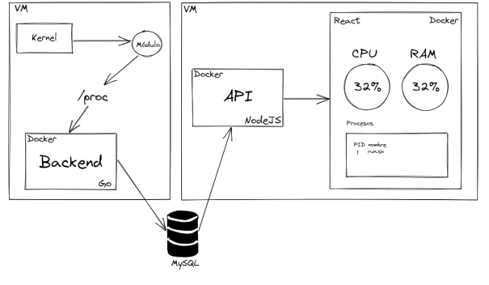
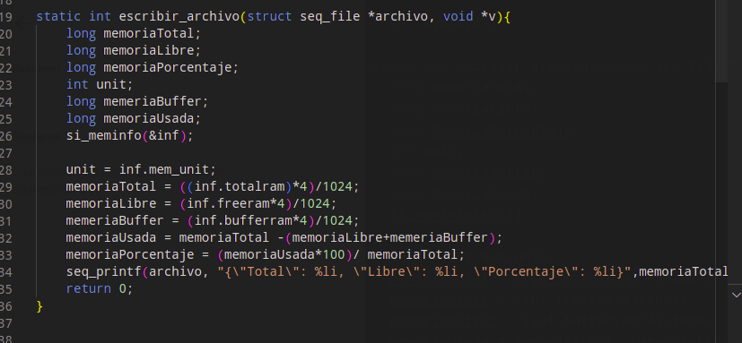
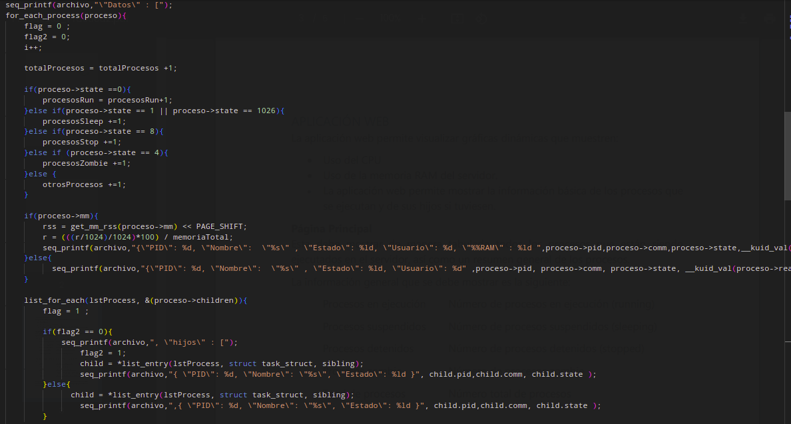
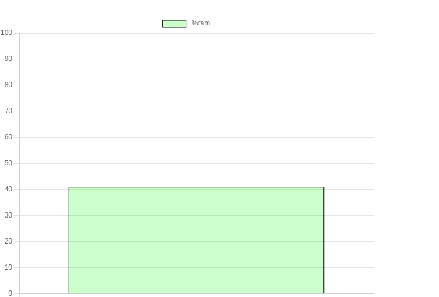
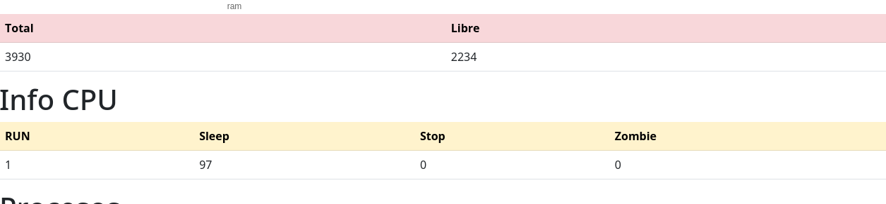
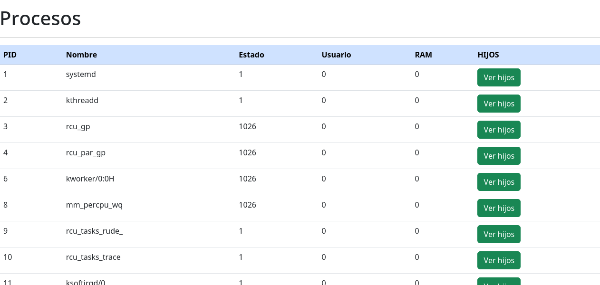
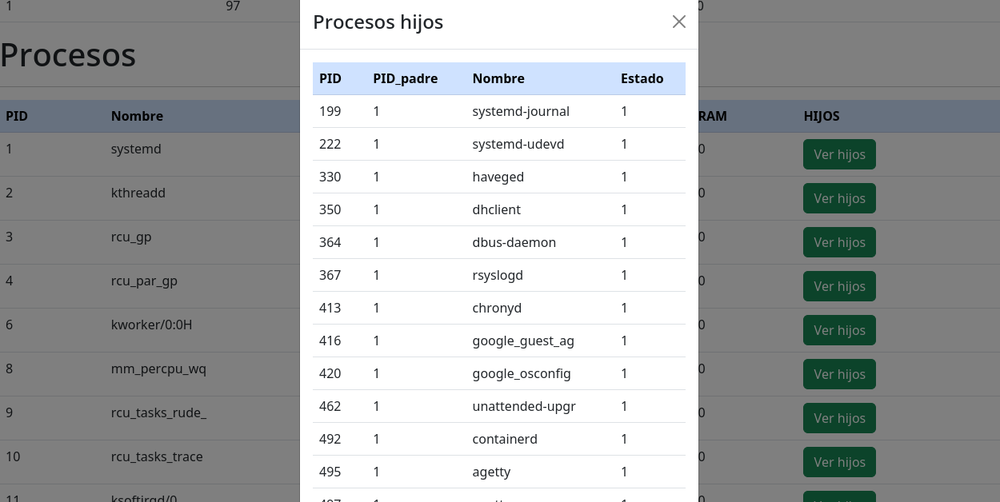

# Practica 2
## Tecnologias  utilizadas
* backend procesos : golang
* Base de datos: mysql en cloudmysql
* Informacion de modulos: lenguaje C
* backend API: node.js
* Frontend : Rect 
* docker 
* mv google cloud
## Arquitectura

# kernel:
## modulos implementados:
## Módulo de Memoria RAM (sysinfo) 
* Importar librería <sys/sysinfo.h>
* Debe imprimir el número de carnet al cargar el módulo (insmod).
* • Debe imprimir el nombre del curso al descargar el módulo (rmmod)
* La información que se mostrará en el módulo debe ser obtenida por medio
de los struct de información del sistema operativo y no de la lectura de otro
archivo o comandos de consola.
* El nombre del módulo será: ram_<<carnet>>

## Módulo CPU (task_struct) 
*  Importar librerías: <linux/sched.h>, <linux/sched/signal.h>
* Debe imprimir el nombre del estudiante al cargar el módulo (insmod).
* Debe imprimir “Primer Semestre 2023” al descargar el módulo (rmmod)

## Aplicacion web

La aplicación web permite visualizar gráficas dinámicas que muestren:

* Uso del CPU
* Uso de la memoria RAM del servidor.
* La aplicación web permite mostrar la información básica de los procesos que
se ejecutan y de sus hijos si tuviesen

